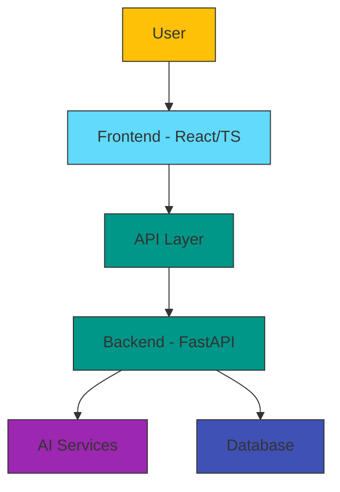

# 🌟 Asha AI - Empowering Women Through Career Guidance

[](https://github.com/koradiaishita/asha-ai-hackathon)
[](https://reactjs.org/)
[](https://fastapi.tiangolo.com/)
[](https://www.typescriptlang.org/)
[](https://mui.com/)
[](https://opensource.org/licenses/MIT)

## 📋 Project Overview

Asha AI is an innovative career assistant designed specifically for women returning to the workforce, career changers, and job seekers. This AI-powered platform offers personalized guidance, resources, and tools to help women overcome barriers in their professional journey.

> *"Empowering women to build rewarding careers with AI assistance"*

### 🎯 Mission

To create an accessible, personalized AI platform that empowers women to overcome career barriers, develop relevant skills, and confidently navigate their professional journeys.

### 🌟 Key Features

| Feature | Description | Status | Benefits |
|---------|-------------|--------|----------|
| 💬 **AI Chatbot** | Context-aware assistant providing career guidance | ✅ Complete | 24/7 personalized advice |
| 📝 **Resume AI** | Smart resume builder with personalized recommendations | ✅ Complete | Optimized job applications |
| 🚀 **Upskill Navigator** | Custom learning pathways based on career goals | ✅ Complete | Targeted skill development |
| 🎯 **Interview AI** | AI-powered interview preparation and feedback | 🔄 In Progress | Improved interview confidence |
| 👥 **Mentorship** | Connect with industry professionals | 🔄 In Progress | Expert career guidance |
| 📅 **Events** | Access to workshops, webinars, and networking opportunities | 🔄 In Progress | Community support |

## 🏆 Project Impact

Asha AI addresses critical challenges that women face in their career journeys:

- 🔹 **Career Gaps**: Simplifies the return-to-work process after career breaks
- 🔹 **Bias Reduction**: Reduces bias in job application processes
- 🔹 **Skill Development**: Provides personalized skill development recommendations
- 🔹 **Accessibility**: Offers confidential career guidance 24/7
- 🔹 **Community Building**: Creates a supportive community for women professionals

## 💻 Technical Architecture



### 🖥️ Frontend

| Technology | Version | Purpose |
|------------|---------|---------|
| React | 19.0.0 | UI Framework |
| TypeScript | 5.7.2 | Type Safety |
| Material UI | 7.0.1 | Component Library |
| Framer Motion | 12.6.3 | Animations |
| File-Saver | 2.0.5 | Document Export |
| DOCX | 9.3.0 | Resume Generation |
| React Router | 7.5.0 | Routing |

### 🔧 Backend

| Technology | Version | Purpose |
|------------|---------|---------|
| FastAPI | 0.100.0 | API Framework |
| Uvicorn | 0.22.0 | ASGI Server |
| Pydantic | 2.0.2 | Data Validation |
| Python-dotenv | 1.0.0 | Environment Variables |

## 🚀 Getting Started

### Prerequisites

- Node.js (v18+)
- Python (v3.10+)
- npm or yarn

### Installation and Setup

<details>
<summary><b>📱 Frontend Setup</b></summary>

```bash
# Navigate to frontend directory
cd frontend

# Install dependencies
npm install

# Start development server
npm run dev
```
</details>

<details>
<summary><b>⚙️ Backend Setup</b></summary>

```bash
# Navigate to backend directory
cd backend

# Create virtual environment
python -m venv venv
source venv/bin/activate  # On Windows: venv\Scripts\activate

# Install dependencies
pip install -r requirements.txt

# Start backend server
uvicorn main:app --reload
```
</details>

## 📸 Screenshots

<div align="center">
  
  <p><i>Asha AI's intuitive user interface</i></p>
</div>

## 🛠️ Development Roadmap

### Current Phase
- ✅ Core AI chatbot functionality
- ✅ Resume builder with AI suggestions
- ✅ Skill development pathways

### Next Phase (Q2 2025)
- 📱 Mobile application development
- 🔄 Integration with job portals
- 🧠 Advanced skills assessment

### Future Enhancements (Q3-Q4 2025)
- 📊 Career analytics dashboard
- 🌐 Multi-language support
- 🤝 Employer partnerships program
- 🧩 API extensions for third-party integrations

## 👩‍💻 Contributors

This project was developed as part of the 2025 Women in Tech Hackathon by:

- [Team Members]

## 📄 License

This project is licensed under the MIT License - see the LICENSE file for details.

---

<div align="center">
  <h3>🌈 Bridging Career Gaps, Building Brighter Futures</h3>
  <p><i>Asha AI - Your AI career partner, every step of the way</i></p>
</div>
