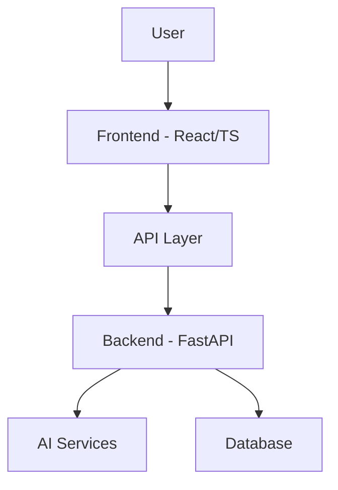

# Asha AI - Empowering Women Through Career Guidance 🚀👩‍💼

[](https://github.com/koradiaishita/asha-ai-hackathon)
[](https://reactjs.org/)
[](https://fastapi.tiangolo.com/)
[](https://www.typescriptlang.org/)

## 📋 Project Overview

Asha AI is an innovative career assistant designed specifically for women returning to the workforce, career changers, and job seekers. This AI-powered platform offers personalized guidance, resources, and tools to help women overcome barriers in their professional journey.

### 🌟 Key Features

| Feature | Description | Status |
|---------|-------------|--------|
| 💬 **AI Chatbot** | Context-aware assistant providing career guidance | ✅ |
| 📝 **Resume AI** | Smart resume builder with personalized recommendations | ✅ |
| 🚀 **Upskill Navigator** | Custom learning pathways based on career goals | ✅ |
| 🎯 **Interview AI** | AI-powered interview preparation and feedback | 🔄 |
| 👥 **Mentorship** | Connect with industry professionals | 🔄 |
| 📅 **Events** | Access to workshops, webinars, and networking opportunities | 🔄 |

## 🏆 Project Impact

Asha AI addresses critical challenges that women face in their career journeys:

- 🔹 Simplifies the return-to-work process after career breaks
- 🔹 Reduces bias in job application processes
- 🔹 Provides personalized skill development recommendations
- 🔹 Offers confidential career guidance 24/7
- 🔹 Creates a supportive community for women professionals

## 💻 Technical Architecture



### Frontend 🖥️
- **Framework**: React 19 with TypeScript
- **UI Components**: Material UI v7
- **State Management**: React Context API
- **Animation**: Framer Motion
- **File Handling**: File-Saver, DOCX

### Backend 🔧
- **Framework**: FastAPI
- **Authentication**: JWT
- **Validation**: Pydantic
- **Server**: Uvicorn

## 🚀 Getting Started

### Prerequisites
- Node.js (v18+)
- Python (v3.10+)
- npm or yarn

### Installation and Setup

**Frontend:**
```bash
# Navigate to frontend directory
cd frontend

# Install dependencies
npm install

# Start development server
npm run dev
```

**Backend:**
```bash
# Navigate to backend directory
cd backend

# Create virtual environment
python -m venv venv
source venv/bin/activate  # On Windows: venv\Scripts\activate

# Install dependencies
pip install -r requirements.txt

# Start backend server
uvicorn main:app --reload
```

## 📸 Screenshots


## 🛠️ Future Enhancements

- 📱 Mobile application development
- 🔄 Integration with job portals
- 🧠 Advanced skills assessment
- 📊 Career analytics dashboard
- 🌐 Multi-language support

## 👩‍💻 Contributors

This project was developed as part of the 2025 Women in Tech Hackathon.

## 📄 License

This project is licensed under the MIT License - see the LICENSE file for details.

---

<div align="center">
  <p><i>Empowering women to build rewarding careers with AI assistance.</i></p>
</div>
